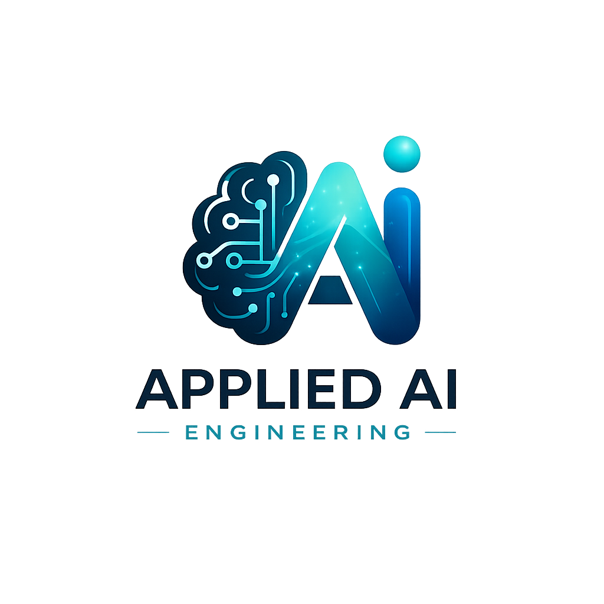

# Applied AI Engineering Handbook

This handbook documents my journey toward becoming a production-ready Applied AI Engineer.

Topics include:

- Backend Engineering
- AI Systems
- RAG
- Cloud Infrastructure
- Docker
- GCP
- Software Architecture
- AI Agents
- Production Systems

---

## Current Learning Path

### Layer 1 — Software Engineering Foundations

- Python Engineering
- Git & GitHub
- Project Structure
- Software Architecture

### Layer 2 — Backend Engineering

- HTTP
- APIs
- Authentication
- Databases
- Business Logic

### Layer 3 — AI Engineering

- LLMs
- RAG
- Vector Databases
- Agents

---

## Goal

Become a production-ready Applied AI Engineer with strong backend, cloud, and AI systems knowledge.